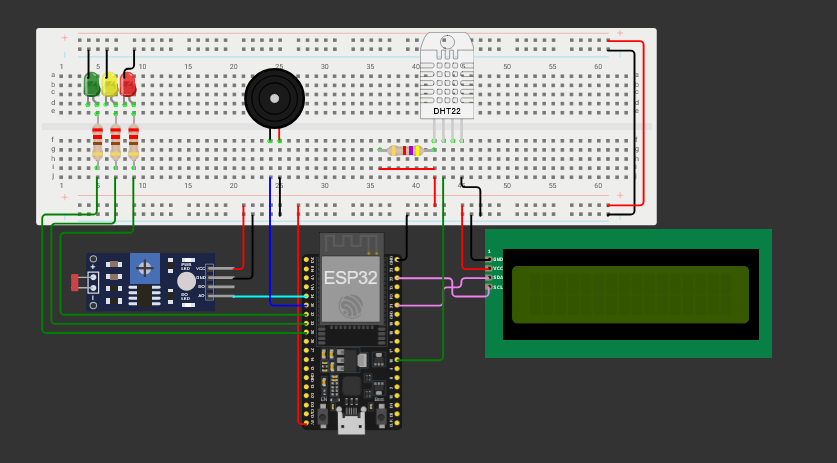

# 🌡️ Sistema de Monitoramento Ambiental com ESP32

Projeto desenvolvido para monitorar **temperatura, umidade e luminosidade** em tempo real utilizando o **ESP32**, exibindo os valores em um display **LCD I2C** e acionando **LEDs** e **buzzer piezo** conforme o estado do ambiente (OK, ALERTA ou PERIGO).

---

## 🧠 Objetivo

Criar um sistema capaz de:

- Detectar variações ambientais críticas.
- Exibir leituras em um display LCD.
- Acionar alarmes visuais (LEDs) e sonoros (Piezo).
- Demonstrar integração entre sensores e atuadores no ESP32.

---

## ⚙️ Componentes utilizados

| Componente | Função | Pinos utilizados |
|-------------|--------|------------------|
| ESP32 | Microcontrolador principal | — |
| DHT22 | Sensor de temperatura e umidade | GPIO 16 |
| LDR + resistor (10kΩ) | Sensor de luminosidade | GPIO 34 |
| LCD I2C (16x2) | Exibição das medições | SDA/SCL (I2C) |
| LED Verde | Indica ambiente OK | GPIO 25 |
| LED Amarelo | Indica alerta | GPIO 33 |
| LED Vermelho | Indica perigo | GPIO 32 |
| Buzzer Piezo | Alerta sonoro | GPIO 35 |

---

## 🧩 Ligações elétricas (esquemático)

<div align="center">



</div>

## 💻 Simulação Wokwi

Para testar o projeto sem precisar da VM ou hardware físico, você pode usar a simulação no **Wokwi**:  
[Link da Simulação Wokwi](https://wokwi.com/projects/444923253527449601)

## 🧰 Componentes Utilizados

- **ESP32 Dev Module**
- **Sensor DHT22** – mede temperatura e umidade do ambiente  
- **LDR (Sensor de Luminosidade)** – mede intensidade da luz  
- **LCD 16x2 com módulo I2C** – exibe leituras e estado atual  
- **Buzzer Piezoelétrico** – emite alertas sonoros  
- **LEDs (3x):**
  - Verde – Estado OK  
  - Amarelo – Estado de Alerta  
  - Vermelho – Estado de Perigo  
- **Resistores** (para LEDs e LDR)
- **Jumpers e Protoboard**

---

## 🧠 Função dos Componentes

| Componente | Função |
|-------------|--------|
| **ESP32** | Unidade principal. Faz leitura dos sensores, controla LEDs, buzina e envia dados via Wi-Fi/MQTT. |
| **DHT22** | Mede a temperatura (°C) e umidade relativa do ar (%). |
| **LDR** | Detecta a luminosidade do ambiente e converte em percentual. |
| **LCD I2C 16x2** | Mostra os valores lidos e mensagens de status (“OK”, “ALERTA”, “PERIGO”). |
| **Buzzer (Piezo)** | Emite sons de alerta quando há risco ambiental. |
| **LEDs** | Indicadores visuais do estado do ambiente. |

---

## ⚙️ Recursos Necessários

### 🧩 Hardware (Simulação no Wokwi)
- ESP32 Dev Module  
- Sensor DHT22  
- LDR com resistor de pull-down  
- Buzzer  
- LEDs (vermelho, amarelo, verde)  
- Display LCD I2C  
- Protoboard + Jumpers  

### 💡 Hardware (Físico)
- Mesmo da simulação  
- Cabo USB para alimentação e programação  
- Fonte de 5V (opcional para operação autônoma)

### 💻 Software / Ferramentas

- **Arduino IDE** (ou PlatformIO)
- **Bibliotecas**:
  - `WiFi.h`
  - `PubSubClient.h`
  - `DHT.h`
  - `DHT_U.h`
  - `LiquidCrystal_I2C.h`
- **Broker MQTT** (ex: Mosquitto, HiveMQ ou FIWARE)
- **MQTT Explorer** ou **mosquitto_pub/sub** (para testes)

---

## 📡 Configuração MQTT

| Parâmetro | Valor |
|------------|--------|
| **Broker** | `{PUBLIC_IP_VM}` |
| **Porta** | `1883` |
| **Tópico de publicação** | `esp32/ambiente/dados` |
| **Tópicos de comando** | `esp32/ambiente/buzzer`, `esp32/ambiente/led_ok`, `esp32/ambiente/led_alert`, `esp32/ambiente/led_danger` |

### 🔄 Exemplo de Mensagem Publicada

```json
{
  "temperatura": 18.75,
  "umidade": 65.20,
  "luminosidade": 41,
  "estado": "OK"
}
```

---

## 💻 Código-fonte

O código principal está no arquivo:
[👉 Visualizar código no GitHub](sourceCode/esp32_monitoring.cpp)

---

## 📚 Principais bibliotecas

```cpp
#include <Adafruit_Sensor.h>
#include <DHT.h>
#include <DHT_U.h>
#include <Wire.h>
#include <LiquidCrystal_I2C.h>
```

Instale-as na IDE do Arduino via Gerenciador de Bibliotecas.

---

## 🚦 Lógica de funcionamento

| Estado | Condições | Ações |
|-------------|--------|------------------|
| OK (LED Verde) | LDR < 33, Temp 10–18°C, Umid 60–70% | Exibe mensagens de status OK no LCD |
| ALERTA (LED Amarelo) | Valores próximos ao limite | Liga buzzer 3s e alerta no LCD |
| PERIGO (LED Vermelho) | Valores fora da faixa padrão | Buzzer constante e alerta no LCD |

---

## 🔁 Fluxo de execução

1. Leitura dos sensores (DHT e LDR)
2. Conversão dos valores (map)
3. Verificação do estado (OK, ALERTA, PERIGO)
4. Ação correspondente:
    - LEDs acesos
    - LCD atualiza mensagem
    - Piezo emite som, se necessário

---

## 🧠 Faixas de referência

| Parâmetro | OK | ALERTA | PERIGO |
|-------------|--------|------------------|------------------|
| Temperatura | 10–18°C | 8–10 ou 18–20°C | <8 ou >20°C |
| Umidade | 60–70% | 50–60 ou 70–75% | <50 ou >75% |
| Luminosidade | <33% | 33–66% | >66% |

---

## 🗂️ Estrutura do repositório

```bash
📁 esp32-smart-environment
│
├── 📄 README.md
├── 📁 sourceCode
│   └── esp32_monitoring.cpp
├── 📁 images
│   └── system_schematic.png
└── 📁 configs
    └── mymqtt_config.txt
```

---

## 👥 Integrantes do Grupo

| [<br><sub>Davi Marques</sub>](https://github.com/DaviMunhoz1005) |  [<br><sub>Gabriel Ciriaco</sub>](https://github.com/Gabsgc01) | [<br><sub>Mariana Souza</sub>](https://github.com/MariFranca) | [<br><sub>Larissa Shiba</sub>](https://github.com/larissashiba) | [<br><sub>Vinicius Mafra</sub>](https://github.com/Mafraaa) | 
| :---: | :---: | :---: | :---: | :---: |
